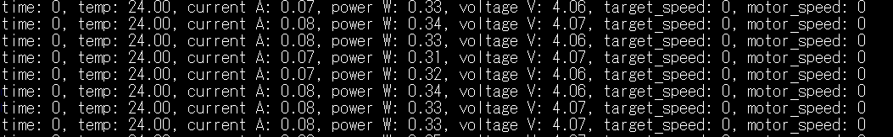

Project Overview: Closed-Loop Drive System

This project is a multi-node closed-loop drive control system consisting of two main processing units: STM32F407 and STM32F103 (Blue Pill).
1. Motion Control Node (STM32F407)

The core of the system, responsible for high-speed motor regulation and data management:

    Motor Control: Implements PID regulation via PWM, utilizing encoder feedback and sensor measurements for precise motion.

    Data Logging: Performs real-time logging of system parameters to an SD card (FATFS, .csv files) and via UART.

    Operating System: Runs on FreeRTOS to ensure deterministic multitasking.

    Diagnostics: Supports SEGGER debugging. All communication protocols are optimized using DMA and Interrupt (IT) functions within the OSAL layer.

2. User Interface Node (STM32F103)

A dedicated MCU for human-machine interaction:

    I/O Peripherals: Features an OLED display, physical buttons, and a potentiometer for manual speed control.

    Control: Acts as the primary input for setpoints and system monitoring.

3. Communication & Architecture

    Inter-node Communication: The MCUs communicate via a CAN bus using a custom command table where each command is assigned a specific priority.

    Software Design: The project follows a strict 3-level architecture:

        BSP (Board Support Package): Hardware abstraction and HAL-level drivers.

        OSAL (Operating System Abstraction Layer): Integration of FreeRTOS features, thread-safe DMA operations, and synchronization.

        APP (Application Layer): High-level logic for user applications and control algorithms.

UART logs print
